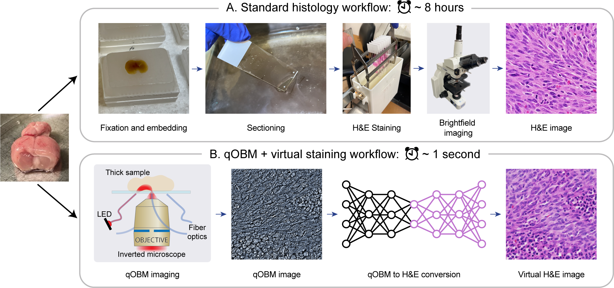

# Label- and slide-free tissue histology using 3D epi-mode quantitative phase imaging and virtual H&E staining


Tanishq Mathew Abraham, Paloma Casteleiro Costa, Caroline Filan, Zhe Guang, Zhaobin Zhang,
Stewart Neill, Jeffrey J. Olson, Richard Levenson, Francisco E. Robles

[arXiv](https://arxiv.org/abs/2306.00548)

---



## Abstract:
> Histological staining of tissue biopsies, especially hematoxylin and eosin (H&E) staining, serves as the benchmark for disease diagnosis and comprehensive clinical assessment of tissue. However, the process is laborious and time-consuming, often limiting its usage in crucial applications such as surgical margin assessment. To address these challenges, we combine an emerging 3D quantitative phase imaging technology, termed quantitative oblique back illumination microscopy (qOBM), with an unsupervised generative adversarial network pipeline to map qOBM phase images of unaltered thick tissues (i.e., label- and slide-free) to virtually stained H&E-like (vH&E) images. We demonstrate that the approach achieves high-fidelity conversions to H&E with subcellular detail using fresh tissue specimens from mouse liver, rat gliosarcoma, and human gliomas. We also show that the framework directly enables additional capabilities such as H&E-like contrast for volumetric imaging. The quality and fidelity of the vH&E images are validated using both a neural network classifier trained on real H&E images and tested on virtual H&E images, and a user study with neuropathologists. Given its simple and low-cost embodiment and ability to provide real-time feedback in vivo, this deep learning-enabled qOBM approach could enable new workflows for histopathology with the potential to significantly save time, labor, and costs in cancer screening, detection, treatment guidance, and more. 


This is the repository for the code used to run CycleGAN-based unpaired qOBM-to-H&E image translation. It uses the [UPIT](https://github.com/tmabraham/UPIT) library for CycleGAN implementation and training.


## Dataset

**Coming soon...**

## Environment

```
$ conda create -n qobmtohe
$ pip install -r requirements.txt
```

## Training

Experiments were run with compute provided by a Stability.AI Compute Grant on a 4 A100 80GB cluster.

All experiments can be replicated by running:
```
python run_all.py --commands_file all_train_commands.txt
python run_all.py --commands_file all_inference_commands.txt
```

These two commands run all the training and inference jobs based on the GPUs available. This is done using [fastgpu](https://fastgpu.fast.ai/).

The individual training runs look like this:
```
python main.py --experiment_name "60x_combined_inverted_larger_gen_disc" --dataset "60x_combined/inverted" --data_dir /mnt/tmabraham/data/qobmtohe/final --disc_layers 6 --gen_blocks 12
```

[Weights and Biases](https://wandb.com) (W&B) is used to track experiments, models, and datasets. The trained model checkpoints are saved by W&B and the inference scripts load the models from W&B. All experiment information is recorded in W&B, such as hyperparameters, the dataset used, loss curves, etc.

The individual inference runs look like this:
```
python inference.py --experiment_name "60x_combined_inverted_larger_gen_disc_inference" --dataset "60x_combined/inverted" --data_dir /mnt/tmabraham/data/qobmtohe/final --disc_layers 6 --gen_blocks 12 --load_model_name "200fit_cyclegan_60x_combined_inverted_larger_gen_disc"
```

## Evaluation

The classifier-based evaluation is available in [this notebook](evaluation-final.ipynb).


## References

If you find this paper or code useful for your research, please consider citing our work:

```
@article{
  abraham2023qobmtohe,
  title={Label- and slide-free tissue histology using 3D epi-mode quantitative phase imaging and virtual H&E staining},
  author={Tanishq Mathew Abraham and Paloma Casteleiro Costa and Caroline Filan and Zhe Guang and Zhaobin Zhang and Stewart Neill and Jeffrey J. Olson and Richard Levenson and Francisco E. Robles},
  journal={arxiv preprint arXiv:2306.00548},
  year={2023}
}
```